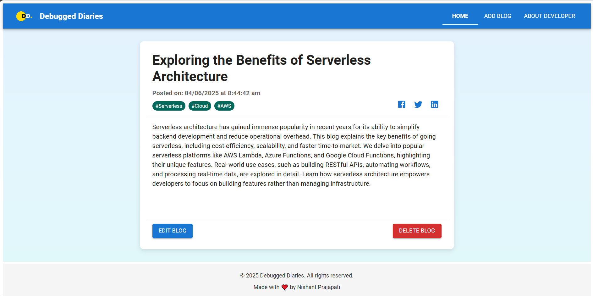
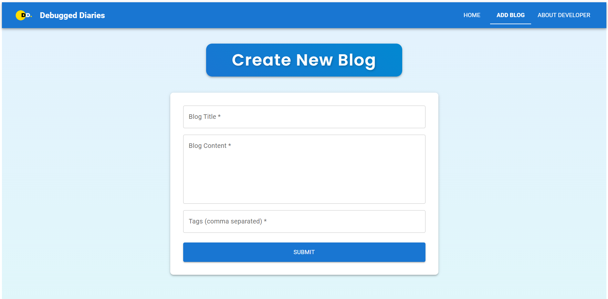
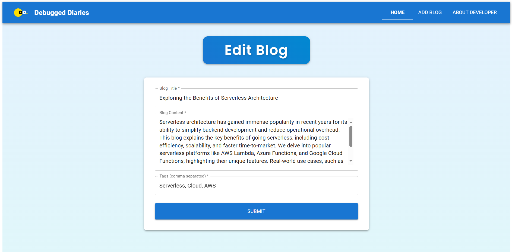
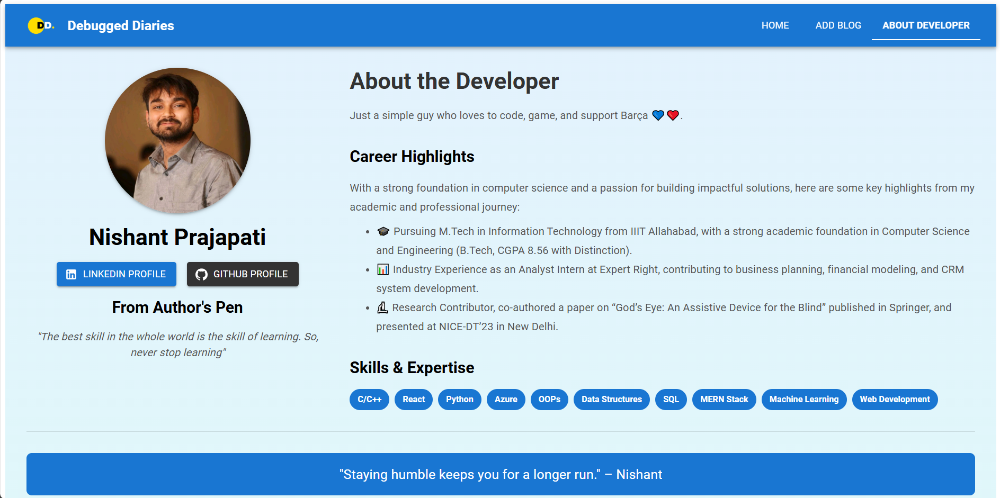

# 📝 Debugged Diaries - Simple Blog Website

### Author: Nishant Prajapati

---

## 🧭 Overview

**Debugged Diaries** is a minimalist yet powerful blogging platform where users can create, share, and manage blog posts effortlessly. With a clean UI and modern tech stack, it offers a seamless user experience for developers and readers alike.

---

## ✨ What's New

- 🔔 **Notifications Update:** In-app toast notifications appear at the top for better visibility.
- ♿ **Accessibility Enhancements:** Added keyboard navigation and ARIA roles.
- ✅ **Custom Validations:** Improved form validation logic for blog creation/editing.
- ✨ **Shimmering Effect:** Skeleton loaders added while fetching blogs.

---

## 🌟 Features

- 🆕 **New Blog Indicator:** Marks today’s posts with a _"New"_ tag.
- 🔔 **Notifications:** Instant feedback for blog actions.
- 🔗 **Share Blog:** Easily share blogs via link.
- ✍️ **Edit Blog:** Modify existing blog content.
- 🔍 **Filter Blogs:** Search blogs by title or tags for quick access.

---

## 🖼️ Screenshots

### 🏠 Home Page


### 📚 Blog View


### ➕ Create Blog


### ✏️ Edit Blog


### ℹ️ About Page


---

## 🧰 Tech Stack

- **Frontend:** React, TypeScript, Material UI  
- **Backend:** Node.js, Express.js  
- **Database:** SQLite  
- **Styling Framework:** KendoReact (`create-kendoreact-app`)  

---

## ⚙️ Installation and Setup

### 🔧 Prerequisites

- Node.js (v14+)
- npm or yarn

---

### 🛠️ Backend Setup

```bash
git clone https://github.com/NishantPrajapati/debugged-diaries.git
cd debugged-diaries/backend
npm install
npm start
```
---

### 🎨 Frontend Setup

```bash
cd ../frontend
npm install
```

Important: Update the backend URL in src/services/blogService.ts:

```ts
const BASE_URL = "http://localhost:5000";
```
Start the frontend application:

```bash
npm start
```
---

## 🔍 Usage
Open the homepage to view blogs.

Use Add Blog to create a new post.

Filter blogs using title or tags.

Use the Edit button to modify content.

Click Share to get a link to a blog.
